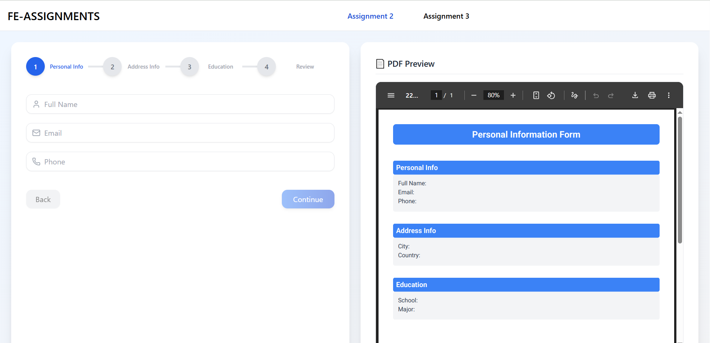
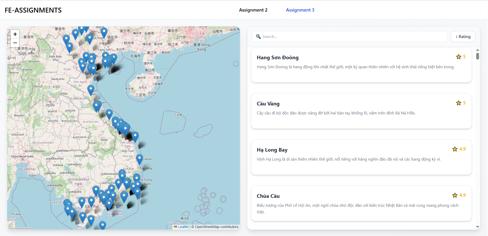

# Fresher Front-end Engineer Assignment - Aug 2025

## Candidate Submission

This repository contains my implementation for the **Fresher Front-end Engineer Assignment (Aug 2025)**.  
I have completed the following assignments:

-   **A2: Multi-Step Form with Live PDF Preview**
-   **A3: Map & Location List Synchronization**

The project is built with:

-   **React + TypeScript**
-   **TailwindCSS** & [shadcn/ui](https://ui.shadcn.com/) for UI components
-   **Redux Toolkit** for state management
-   **React Router** for navigation
-   **Leaflet** for interactive map
-   **react-pdf/renderer** for live PDF preview

---

## 🚀 Live Demo

You can view the deployed project here:  
👉 [https://fe-assignment-aug-2025.vercel.app/a3](https://fe-assignment-aug-2025.vercel.app)

---

## 📂 Implemented Assignments

### A2: Multi-Step Form with Live PDF Preview

### A3: Map & Location List Synchronization

---

## 🛠️ Getting Started

Clone repository:

### 1. `git clone https://github.com/kansimp/fe-assignment.aug-2025.git`

Open the project folder in your preferred code editor and install all required dependencies:

### 2. `npm install`

Run project:

### 3. `npm start`
